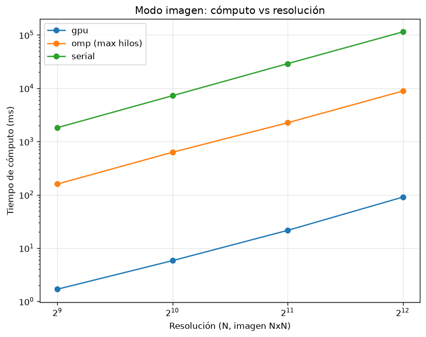
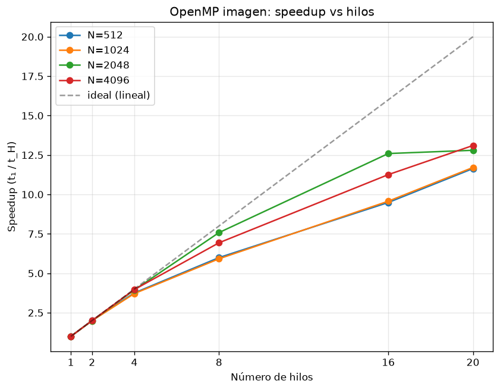
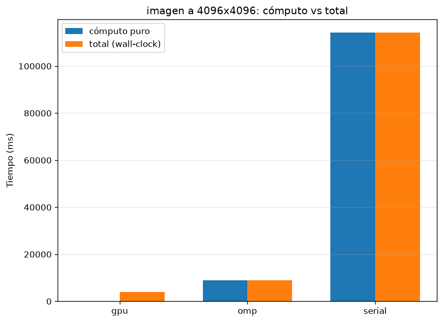
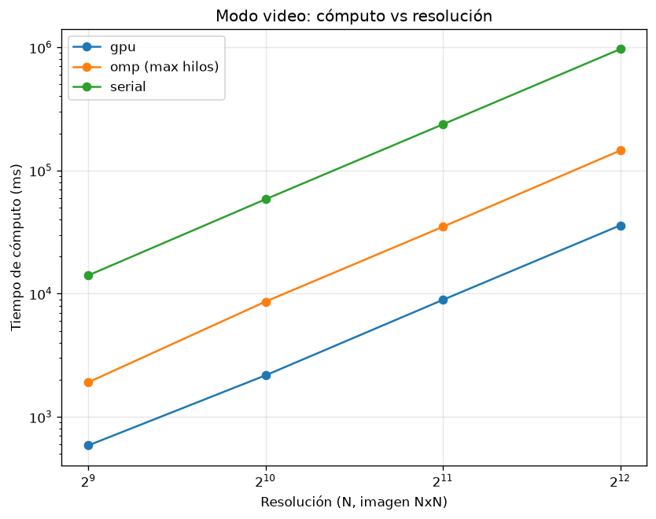
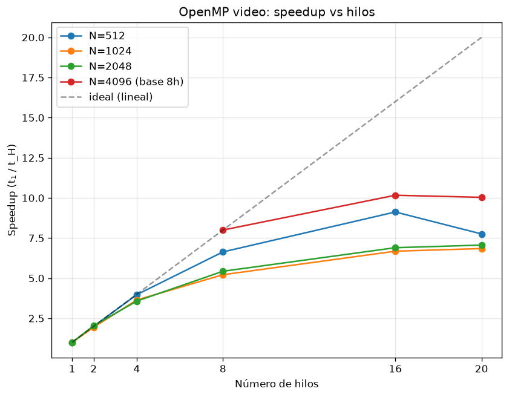

# Simulación de un Agujero Negro mediante Trazado de Geodésicas: Comparación de Estrategias de Paralelización CPU y GPU

**Autor:** _Luciano Ambiado_
---

## Índice

1. [Introducción](#1-introducción)
2. [Planteamiento del problema](#2-planteamiento-del-problema)
3. [Fundamento matemático](#3-fundamento-matemático)
4. [Explicación del código](#4-explicación-del-código)
5. [Metodología](#5-metodología)
6. [Resultados](#6-resultados)
7. [Conclusiones](#7-conclusiones)
8. [Referencias](#8-referencias)

---

## 1. Introducción

Los agujeros negros son una de las predicciones más notables de la Teoría General de la Relatividad de Einstein. Su intensa curvatura del espacio-tiempo desvía la trayectoria de la luz de forma tan pronunciada que produce fenómenos visualmente espectaculares, como la *sombra* central, el *anillo de fotones* y el efecto de *lente gravitacional* sobre los objetos que se encuentran detrás de ellos.

Simular la apariencia de un agujero negro requiere integrar numéricamente la trayectoria de los rayos de luz —las *geodésicas nulas*— a través del espacio-tiempo curvo. Este cálculo es computacionalmente costoso pero **masivamente paralelo**: la trayectoria de cada rayo de luz, y por tanto el color de cada píxel de la imagen, es completamente independiente de los demás. Esta característica lo convierte en un caso de estudio ideal para el cómputo de alto rendimiento (HPC).

El presente trabajo tiene un doble objetivo. Por un lado, **físico y visual**: reproducir la imagen de un agujero negro de Schwarzschild, incluyendo su disco de acreción y el efecto de lente gravitacional sobre objetos en órbita. Por otro lado, y como foco principal del curso, **de rendimiento**: implementar el mismo algoritmo en tres versiones —secuencial (CPU), paralela en CPU mediante OpenMP, y paralela en GPU mediante *compute shaders* de Vulkan— y comparar cuantitativamente su desempeño para evaluar las ventajas y los costos de cada estrategia de paralelización.

---

## 2. Planteamiento del problema

El problema central es **renderizar una imagen de un agujero negro** trazando, para cada píxel, un rayo de luz hacia atrás desde la cámara y determinando su destino: caer en el horizonte de eventos, impactar el disco de acreción, escapar al fondo estelar, o interceptar un objeto de la escena.

Desde la perspectiva de HPC, el problema se formula como sigue: dado un algoritmo de coste elevado y estructura *embarazosamente paralela* (sin dependencias de datos entre unidades de trabajo), se busca:

1. Establecer una **versión secuencial de referencia** (*baseline*) que sirva como verdad-base de correctitud y punto de comparación de rendimiento.
2. **Paralelizar en CPU** mediante OpenMP, repartiendo los píxeles entre los núcleos disponibles, y medir el *speedup* en función del número de hilos.
3. **Paralelizar en GPU** mediante un *compute shader* de Vulkan, aprovechando los miles de núcleos de la tarjeta gráfica.
4. Comparar las tres versiones a resoluciones crecientes, midiendo tanto el tiempo de cómputo puro como el tiempo total de ejecución.

El proyecto se organiza en dos modos de ejecución:

- **Modo imagen (base):** genera una sola fotografía del agujero negro con su disco de acreción. Es idéntico en las tres versiones, lo que garantiza una comparación de rendimiento justa.
- **Modo video (extendido):** genera una secuencia de fotogramas de esferas orbitando el agujero negro, mostrando el efecto de lente gravitacional en movimiento. Representa una carga de trabajo intensiva, adecuada para evaluar el rendimiento en condiciones exigentes.

---

## 3. Fundamento matemático

### 3.1 La métrica de Schwarzschild

Un agujero negro estático y sin rotación se describe mediante la **métrica de Schwarzschild**, solución de las ecuaciones de campo de Einstein para el vacío alrededor de una masa esférica $M$. En coordenadas esféricas $(t, r, \theta, \phi)$ y unidades geometrizadas ($G = c = 1$), el elemento de línea es:

$$
ds^2 = -\left(1 - \frac{2M}{r}\right)dt^2 + \left(1 - \frac{2M}{r}\right)^{-1}dr^2 + r^2\left(d\theta^2 + \sin^2\theta\, d\phi^2\right)
$$

El **radio de Schwarzschild** $r_s = 2M$ define el horizonte de eventos: la superficie desde la cual ni la luz puede escapar. En las unidades adoptadas en este trabajo ($M = 1$), se tiene $r_s = 2$.

### 3.2 Geodésicas de la luz

La luz viaja siguiendo **geodésicas nulas** del espacio-tiempo. En la métrica de Schwarzschild, la simetría esférica implica que toda geodésica está confinada a un plano que pasa por el centro, lo que permite reducir el problema al plano ecuatorial ($\theta = \pi/2$) sin pérdida de generalidad.

En este plano, y aprovechando las cantidades conservadas del movimiento (la energía $E$ y el momento angular $L$), la trayectoria de un fotón queda descrita por la **ecuación de la órbita** en términos de la variable $u = 1/r$:

$$
\frac{d^2 u}{d\phi^2} + u = 3M u^2
$$

El término de la izquierda corresponde a la trayectoria newtoniana (una recta en coordenadas apropiadas), mientras que el término de la derecha, $3Mu^2$, es la **corrección de la Relatividad General**: es precisamente lo que curva la luz alrededor del agujero negro. Si se anula este término, los rayos viajan en línea recta.

### 3.3 El parámetro de impacto crítico

La condición inicial de cada rayo se obtiene de la primera integral del movimiento:

$$
\left(\frac{du}{d\phi}\right)^2 = \frac{1}{b^2} - u^2\left(1 - 2Mu\right)
$$

donde $b = L/E$ es el **parámetro de impacto**, que mide la distancia perpendicular entre la trayectoria asintótica del rayo y el centro del agujero negro. Existe un valor crítico que separa dos comportamientos cualitativamente distintos:

$$
b_{\text{crit}} = 3\sqrt{3}\,M \approx 5.196\,M
$$

- Si $b < b_{\text{crit}}$, el rayo **cae** inevitablemente al horizonte de eventos.
- Si $b > b_{\text{crit}}$, el rayo es desviado pero **escapa** al infinito.

Este valor define el tamaño angular de la *sombra* del agujero negro y constituye la **prueba de validación** fundamental de la implementación: un integrador correcto debe reproducir la transición caer/escapar exactamente en $b_{\text{crit}} = 3\sqrt{3}$.

### 3.4 Integración numérica: Runge-Kutta 4

La ecuación de la órbita es una ecuación diferencial ordinaria de segundo orden sin solución analítica cerrada en el caso general. Se integra numéricamente mediante el método de **Runge-Kutta de cuarto orden (RK4)**, que ofrece un buen equilibrio entre precisión y coste. Escribiendo la ecuación como un sistema de primer orden con estado $(u, u')$:

$$
\frac{du}{d\phi} = u', \qquad \frac{du'}{d\phi} = 3Mu^2 - u
$$

el método RK4 avanza el estado un paso $\Delta\phi$ combinando cuatro evaluaciones de la derivada, con un error local de orden $O(\Delta\phi^5)$.

### 3.5 Extensión a tres dimensiones

Para el modo extendido, en el cual objetos con posición real orbitan el agujero negro, se requiere un sistema de coordenadas tridimensional común a todos los rayos. La estrategia adoptada consiste en integrar la órbita en el plano del rayo (usando la ecuación validada de la sección 3.2) y **reconstruir la posición tridimensional** del fotón en cada paso a partir de la base ortonormal de dicho plano. Esto permite realizar test de intersección rayo-esfera con objetos ubicados en posiciones arbitrarias del espacio, preservando la física correcta de la deflexión.

### 3.6 Complejidad del algoritmo

**Coste por rayo.** Cada rayo se integra mediante RK4 dando pasos de tamaño $\Delta\phi$ hasta que cae al horizonte, escapa o alcanza un número máximo de pasos $S_{\max}$. Cada paso realiza un número constante de operaciones (cuatro evaluaciones de la derivada más las combinaciones lineales), por lo que el coste de un rayo es $O(S)$, donde $S$ es el número de pasos que efectivamente ejecuta. En el peor caso $S = S_{\max}$ (rayos que se enroscan cerca del horizonte); en el caso favorable, los rayos que escapan directamente terminan en muy pocos pasos. En el modo extendido se añade, en cada paso, un test de intersección contra las $K$ esferas de la escena, elevando el coste por rayo a $O(S \cdot K)$; como $K$ es una constante pequeña (del orden de unas pocas unidades), este factor no altera el orden asintótico.

**Coste secuencial.** Se traza exactamente un rayo por píxel. Para una imagen de $N \times N$ píxeles, el número total de rayos es $P = N^2$. Denotando por $\bar{S}$ el número medio de pasos por rayo, el coste total de la versión secuencial es:

$$
T_{\text{serial}} = O(N^2 \cdot \bar{S})
$$

Como $\bar{S}$ está acotado por la constante $S_{\max}$ e independiente de la resolución, la complejidad es **cuadrática en el lado de la imagen**, o equivalentemente **lineal en el número de píxeles**: $O(N^2) = O(P)$. Para el video de $F$ fotogramas, el coste se multiplica por $F$: $O(F \cdot N^2 \cdot \bar{S})$.

Esta predicción teórica se verifica empíricamente con notable precisión: al duplicar la resolución (y por tanto cuadruplicar el número de píxeles), el tiempo medido se multiplica por un factor muy cercano a cuatro, como se detalla en la sección 6.2.

**Coste paralelo.** La paralelización no reduce la cantidad *total* de trabajo, sino que lo reparte entre $p$ unidades de proceso (hilos de CPU o invocaciones de GPU). Dado que los $P$ rayos son mutuamente independientes —no hay dependencias de datos ni comunicación entre ellos—, el trabajo se distribuye de forma casi perfecta. En el modelo ideal, con $p$ procesadores el coste pasa a:

$$
T_{\text{paralelo}} = O\!\left(\frac{N^2 \cdot \bar{S}}{p}\right)
$$

Es decir, la complejidad asintótica respecto al tamaño del problema **sigue siendo $O(N^2)$**: la paralelización no cambia el orden, sino que divide el tiempo por un factor constante $p$. Esta es una distinción conceptual importante: paralelizar mejora el *factor* de rendimiento (el speedup), no la *clase de complejidad* del algoritmo.

**Límite realista (ley de Amdahl).** El modelo anterior asume paralelización perfecta, lo que no ocurre en la práctica. Si una fracción $f$ del programa es intrínsecamente secuencial (reserva de memoria, escritura del archivo de salida, inicialización del entorno), el speedup máximo alcanzable con $p$ procesadores queda acotado por la **ley de Amdahl**:

$$
S(p) = \frac{1}{f + \dfrac{1 - f}{p}} \xrightarrow[p \to \infty]{} \frac{1}{f}
$$

Esto explica por qué el speedup medido se aleja del ideal lineal al aumentar el número de hilos, y por qué el modo video —con una fracción secuencial $f$ mayor, debido a la escritura de cada fotograma en disco— presenta un techo de escalabilidad más bajo que el modo imagen (véanse las secciones 6.3 y 6.5).

---

## 4. Explicación del código

### 4.1 Núcleo físico compartido

El corazón del proyecto es el integrador de geodésicas. El siguiente fragmento muestra el paso de Runge-Kutta 4, escrito en C++ puro de forma que se traduce casi literalmente al lenguaje de shaders GLSL:

```cpp
// Estado de la órbita: u = 1/r, du = du/dφ
struct State { double u, du; };

// Lado derecho de la ODE:  u'' = 3M u² - u   (M = 1)
static inline State deriv(const State& s) {
    return State{ s.du, 3.0 * s.u * s.u - s.u };
}

// Un paso de Runge-Kutta 4
static inline State rk4_step(const State& s, double h) {
    State k1 = deriv(s);
    State k2 = deriv(State{ s.u + 0.5*h*k1.u, s.du + 0.5*h*k1.du });
    State k3 = deriv(State{ s.u + 0.5*h*k2.u, s.du + 0.5*h*k2.du });
    State k4 = deriv(State{ s.u +     h*k3.u, s.du +     h*k3.du });
    return State{
        s.u  + (h/6.0)*(k1.u  + 2*k2.u  + 2*k3.u  + k4.u ),
        s.du + (h/6.0)*(k1.du + 2*k2.du + 2*k3.du + k4.du)
    };
}
```

Por cada píxel, la función de trazado calcula el parámetro de impacto, fija la condición inicial e integra la trayectoria paso a paso, verificando en cada iteración si el rayo cayó al horizonte, cruzó el disco o escapó.

### 4.2 Las tres versiones

**Versión secuencial (`cpu_serial`).** Un doble bucle recorre todos los píxeles de la imagen, trazando un rayo por cada uno. Constituye la referencia de correctitud y el punto de partida para medir el *speedup*.

**Versión OpenMP (`cpu_omp`).** Idéntica a la secuencial, salvo por una única directiva que reparte las iteraciones del doble bucle entre los hilos de la CPU:

```cpp
#pragma omp parallel for collapse(2) schedule(dynamic, 8)
for (int y = 0; y < N; ++y) {
    for (int x = 0; x < N; ++x) {
        // ... trazado del rayo para el píxel (x, y) ...
    }
}
```

Se emplea `collapse(2)` para fusionar los dos bucles en un único espacio de iteración de $N \times N$ píxeles, y planificación **dinámica** (`schedule(dynamic)`) porque algunos rayos —los que se acercan al horizonte y dan muchas vueltas— requieren más iteraciones que otros, lo que genera un desbalance de carga que la planificación dinámica corrige.

**Versión GPU (`gpu_vulkan`).** El integrador se implementa como un *compute shader* en GLSL, compilado a SPIR-V. Cada invocación del shader procesa un píxel, identificado por su coordenada global:

```glsl
void main() {
    uint x = gl_GlobalInvocationID.x;
    uint y = gl_GlobalInvocationID.y;
    if (x >= uint(p.N) || y >= uint(p.N)) return;
    // ... mismo RK4 y trazado, escribiendo el color en pixels[y*N + x] ...
}
```

Miles de estas invocaciones se ejecutan en paralelo en la GPU. El programa anfitrión (*host*), escrito en C++ con la interfaz RAII de Vulkan, se encarga de seleccionar la GPU discreta, reservar el búfer de salida, cargar el shader, configurar el *pipeline* de cómputo, despachar el trabajo y recuperar la imagen.

### 4.3 Selección de la GPU en sistemas híbridos

El sistema de pruebas cuenta con dos GPU (una integrada Intel y una discreta NVIDIA). El programa selecciona automáticamente la discreta consultando el tipo de cada dispositivo Vulkan:

```cpp
for (auto& pd : physicalDevices)
    if (pd.getProperties().deviceType == vk::PhysicalDeviceType::eDiscreteGpu)
        chosen = std::move(pd);
```

### 4.6 Configuración de escenas (modo video)

En el modo video, las esferas orbitantes no están codificadas de forma fija, sino que se leen de un archivo de texto plano (`scenes/*.txt`). Cada línea define una esfera mediante su radio orbital, inclinación, fase, velocidad, tamaño y color, además de la posición de la cámara. Esto permite experimentar con distintas configuraciones sin recompilar el código.

---

## 5. Metodología

### 5.1 Entorno de pruebas

| Componente | Especificación |
|---|---|
| Sistema operativo | CachyOS (Arch Linux) |
| CPU | 13th Gen Intel(R) Core(TM) i7-13700H (12+8) |
| GPU |NVIDIA GeForce RTX 4060 Max-Q / Mobile |
| RAM | 15.25 GiB |
| Compilador | g++ (GCC) 16.1.1 20260625 |
| Vulkan | Vulkan Instance Version: 1.4.350|

### 5.2 Diseño experimental

Se midió el rendimiento de las tres versiones bajo dos cargas de trabajo, en las resoluciones $512^2$, $1024^2$, $2048^2$ y $4096^2$ píxeles:

- **Modo imagen:** generación de una única imagen.
- **Modo video:** generación de una secuencia de 10 fotogramas.

Para la versión OpenMP se realizó adicionalmente un **barrido del número de hilos**: 1, 2, 4, 8, 16 y 20. Este barrido se aplicó de forma completa en todas las resoluciones del modo imagen y del modo video hasta $2048^2$. Para el caso más costoso —**video a $4096^2$**— el barrido se restringió a 8, 16 y 20 hilos. La razón es de índole práctica: a esa resolución, una sola configuración con 1 hilo se estimó en torno a los 16 minutos por repetición, lo que con 3 repeticiones habría supuesto casi 50 minutos únicamente para ese punto, sin aportar información cualitativamente nueva (el comportamiento con pocos hilos ya queda caracterizado por las resoluciones menores). Se optó por concentrar el esfuerzo de cómputo en la región de interés (muchos hilos), donde se manifiesta la saturación del escalado.

### 5.3 Métricas medidas

Se registraron dos tiempos distintos para cada configuración:

- **Tiempo de cómputo puro:** únicamente la ejecución del núcleo de cálculo (el bucle de píxeles en CPU, o el *dispatch* del shader en GPU). Aísla la capacidad de paralelización bruta.
- **Tiempo total (wall-clock):** desde el inicio hasta el fin del proceso completo, incluyendo la inicialización del entorno (creación del contexto Vulkan en el caso de la GPU) y el guardado del archivo. Refleja la experiencia real de uso.

El *speedup* de la versión OpenMP se calcula como $S(H) = T_1 / T_H$, y la **eficiencia paralela** como $E(H) = S(H) / H$, ambos sobre el cómputo puro.

### 5.4 Procedimiento de medición

Para reducir el ruido, cada configuración se ejecutó múltiples veces (5 repeticiones en modo imagen, 3 en modo video) y se reportan los valores promedio. Antes de las mediciones de rendimiento se validó la correctitud física verificando que la transición caer/escapar de los rayos ocurre en $b_{\text{crit}} = 3\sqrt{3} \approx 5.196$, y que las tres versiones producen imágenes equivalentes (salvo diferencias mínimas atribuibles a que la GPU opera en precisión simple de 32 bits frente a la doble de 64 bits de la CPU).

---

## 6. Resultados

### 6.1 Validación física

El test de validación confirmó que la transición entre la caída al horizonte y el escape al infinito de los rayos ocurre en el parámetro de impacto crítico teórico $b_{\text{crit}} = 3\sqrt{3} \approx 5.196$, lo que valida la implementación de la física.


**Figura 6.1.** *Imagen del agujero negro (modo imagen), mostrando la sombra central, el disco de acreción lensado y el fondo estelar. La forma de anillo del disco es consecuencia directa de la curvatura de la luz: se observa la parte del disco situada detrás del agujero, cuya luz es desviada hacia la cámara.*

### 6.2 Modo imagen: tiempo de cómputo frente a resolución

La Tabla 6.1 resume los tiempos de cómputo puro de las tres versiones (para OpenMP se muestra el mejor caso, con 20 hilos).

**Tabla 6.1.** *Tiempo de cómputo puro (ms) por versión y resolución. Modo imagen.*

| Resolución | Serial | OpenMP (20 h) | GPU | Speedup GPU vs Serial |
|---|---:|---:|---:|---:|
| 512² | 1 818.6 | 159.1 | 1.69 | 1076× |
| 1024² | 7 238.7 | 628.7 | 5.81 | 1245× |
| 2048² | 28 946.8 | 2 247.1 | 21.49 | 1347× |
| 4096² | 114 157.2 | 8 866.6 | 90.47 | 1262× |



**Figura 6.2.** *Tiempo de cómputo en función de la resolución para las tres versiones (escala logarítmica en ambos ejes).*

El tiempo crece de forma aproximadamente cuadrática con el lado de la imagen: al duplicar la resolución, el número de píxeles se cuadruplica y el tiempo aumenta en un factor cercano a cuatro en las tres versiones. Este comportamiento **confirma empíricamente la complejidad $O(N^2)$** deducida en la sección 3.6. La Tabla 6.1b muestra los factores de crecimiento medidos para la versión secuencial:

**Tabla 6.1b.** *Factor de crecimiento del tiempo al duplicar la resolución (serial, cómputo). El valor teórico esperado es 4.0.*

| Transición | Tiempo (ms) | Factor medido |
|---|---:|---:|
| 512² → 1024² | 1 818.6 → 7 238.7 | 3.98× |
| 1024² → 2048² | 7 238.7 → 28 946.8 | 4.00× |
| 2048² → 4096² | 28 946.8 → 114 157.2 | 3.94× |

La coincidencia con el factor teórico de 4.0 es prácticamente exacta, lo que valida que el trabajo por píxel es constante y que el algoritmo escala con el número total de rayos trazados. En términos de cómputo puro, la GPU resulta más de **mil veces** más rápida que la versión secuencial, mientras que OpenMP con 20 hilos se sitúa consistentemente en torno a **13×**.

### 6.3 Escalabilidad de OpenMP: modo imagen



**Figura 6.3.** *Speedup de OpenMP en modo imagen frente al número de hilos (eje horizontal en escala lineal; se marcan únicamente los valores probados). La recta discontinua representa el escalado lineal ideal.*

La Tabla 6.2 detalla el speedup y la eficiencia a $4096^2$, donde el cómputo domina y el ruido de medición es mínimo.

**Tabla 6.2.** *Speedup y eficiencia de OpenMP a 4096². Modo imagen.*

| Hilos | Cómputo (ms) | Speedup | Eficiencia |
|---:|---:|---:|---:|
| 1 | 116 184.8 | 1.00× | 100 % |
| 2 | 58 098.5 | 2.00× | 100 % |
| 4 | 29 269.5 | 3.97× | 99 % |
| 8 | 16 754.0 | 6.93× | 87 % |
| 16 | 10 321.0 | 11.26× | 70 % |
| 20 | 8 866.6 | 13.10× | 66 % |

El escalado es prácticamente ideal hasta 4 hilos (eficiencia ≥ 99 %), lo que confirma el carácter embarazosamente paralelo del problema. A partir de 8 hilos la eficiencia decae, estabilizándose en torno al 66–70 % con 16–20 hilos. Este comportamiento responde a dos factores: la **ley de Amdahl** (la fracción secuencial —reserva de memoria, guardado de la imagen— limita el speedup máximo) y el **hyperthreading** (superado el número de núcleos físicos, los hilos adicionales comparten recursos de ejecución del mismo núcleo). La marcada caída de eficiencia por encima de 8 hilos sugiere que el sistema dispone de _[número]_ núcleos físicos.

### 6.4 Cómputo puro frente a tiempo total: el costo de la GPU

Este es, desde la perspectiva de HPC, el resultado más relevante del trabajo. La Tabla 6.3 contrasta el cómputo puro con el tiempo total de la versión GPU, evidenciando el overhead de inicialización del entorno Vulkan.

**Tabla 6.3.** *Cómputo, total y overhead de la GPU. Modo imagen.*

| Resolución | Cómputo (ms) | Total (ms) | Overhead (ms) | Speedup total vs Serial |
|---|---:|---:|---:|---:|
| 512² | 1.69 | 559.7 | 558 | 3.2× |
| 1024² | 5.81 | 567.8 | 562 | 12.7× |
| 2048² | 21.49 | 1 087.2 | 1 066 | 26.6× |
| 4096² | 90.47 | 4 017.0 | 3 927 | 28.4× |



**Figura 6.4.** *Comparación entre cómputo puro y tiempo total para cada versión a 4096².*

El overhead de la GPU tiene dos componentes. Uno **fijo**, de aproximadamente 550 ms, correspondiente a la inicialización del contexto Vulkan (creación de la instancia, selección del dispositivo, construcción del *pipeline*): se evidencia en que el total a 512² y 1024² es prácticamente idéntico (~560 ms) pese a diferir el cómputo. Y otro **creciente** con la resolución, atribuible a la transferencia de la imagen desde la memoria de la GPU a la del anfitrión y a su guardado en disco (el overhead pasa de 558 ms a casi 4 000 ms).

La consecuencia es central: aunque la GPU es más de mil veces más rápida en cómputo puro, su ventaja en tiempo total se reduce drásticamente para problemas pequeños. El speedup total frente a la versión secuencial pasa de apenas **3.2× a 512²** —donde el costo fijo de arrancar la GPU domina— hasta **28.4× a 4096²**, donde dicho costo se amortiza. Esto responde a la pregunta central sobre cuándo conviene la GPU: **para tareas pequeñas y aisladas el overhead puede anular su ventaja; para cargas grandes o repetitivas, la GPU es claramente superior.**

### 6.5 Modo video: carga intensiva y escalabilidad

El modo video, que genera una secuencia de fotogramas, constituye la carga intensiva donde el costo fijo de inicialización se amortiza a lo largo de muchos despachos. La Tabla 6.4 muestra los tiempos totales de generación de la secuencia.

**Tabla 6.4.** *Tiempo total (ms) de generación del video por versión y resolución. OpenMP con 20 hilos.*

| Resolución | Serial | OpenMP (20 h) | GPU | Speedup GPU vs Serial |
|---|---:|---:|---:|---:|
| 512² | 14 291.0 | 2 211.0 | 1 348.2 | 10.6× |
| 1024² | 58 624.9 | 8 989.3 | 2 327.9 | 25.2× |
| 2048² | 237 138.9 | 35 310.8 | 9 142.1 | 25.9× |
| 4096² | — | 145 808.0 | 36 105.0 | — |



**Figura 6.5.** *Tiempo de cómputo en función de la resolución para el modo video.*

En esta carga la ventaja de la GPU es consistente y elevada (hasta ~26× frente a la versión secuencial en tiempo total), pues el overhead de inicialización se reparte entre todos los fotogramas. A $4096^2$ únicamente se completaron las versiones GPU y OpenMP: la versión secuencial resultó prohibitivamente lenta (a $2048^2$ ya requiere casi cuatro minutos), lo que por sí mismo ilustra la necesidad de la aceleración para cargas de esta magnitud.

El análisis de escalabilidad de OpenMP en video revela un comportamiento **notablemente peor** que en imagen, como muestra la Tabla 6.5.

**Tabla 6.5.** *Eficiencia de OpenMP en modo video, por resolución y número de hilos. Se contrasta con la eficiencia del modo imagen a 4096².*

| Hilos | Video 512² | Video 1024² | Video 2048² | Imagen 4096² |
|---:|---:|---:|---:|---:|
| 1 | 100 % | 100 % | 100 % | 100 % |
| 2 | 100 % | 97 % | 102 % | 100 % |
| 4 | 99 % | 91 % | 89 % | 99 % |
| 8 | 83 % | 65 % | 68 % | 87 % |
| 16 | 57 % | 42 % | 43 % | 70 % |
| 20 | 39 % | 34 % | 35 % | 66 % |



**Figura 6.6.** *Speedup de OpenMP en modo video frente al número de hilos. La serie de $4096^2$ toma como base 8 hilos, por lo que su speedup se expresa relativo a esa configuración.*

La eficiencia en video decae mucho más rápido que en imagen: con 20 hilos cae al 34–39 %, frente al 66 % del modo imagen. El caso más ilustrativo es el de $512^2$, donde el speedup con 20 hilos (7.76×) es **inferior** al obtenido con 16 hilos (9.12×): añadir hilos llega a empeorar el rendimiento. La causa es la mayor **fracción secuencial** del modo video: por cada fotograma se lee el archivo de escena, se calculan las órbitas y, sobre todo, se guarda la imagen en disco. Este último es un cuello de botella de entrada/salida que no se paraleliza y que, conforme a la ley de Amdahl, limita el speedup; al aumentar los hilos, el tiempo de cómputo se reduce pero el de E/S permanece constante, hasta dominar el total. En la resolución más pequeña, donde el cómputo por fotograma es menor, este efecto es más acusado, hasta el punto de que la contención por el acceso a disco supera la ganancia de más hilos.


**Figura 6.7.** *Fotograma del modo video mostrando el efecto de lente gravitacional sobre una esfera en órbita que pasa detrás del agujero negro, formando un anillo de Einstein.*

---

## 7. Conclusiones

El presente trabajo implementó y comparó tres estrategias de cómputo —secuencial, paralela en CPU (OpenMP) y paralela en GPU (Vulkan compute)— para la simulación de un agujero negro mediante el trazado de geodésicas de la luz. De los resultados se extraen las siguientes conclusiones.

**Sobre la correctitud física.** La implementación reproduce el parámetro de impacto crítico teórico $b_{\text{crit}} = 3\sqrt{3} \approx 5.196$, lo que valida la correcta integración de las geodésicas de Schwarzschild. Las imágenes generadas muestran de forma físicamente consistente la sombra del agujero negro, el disco de acreción lensado y el efecto de lente gravitacional sobre objetos en órbita, incluyendo anillos de Einstein.

**Sobre la paralelización en CPU.** La versión OpenMP alcanzó un speedup máximo de ≈13× con 20 hilos en modo imagen. El escalado es prácticamente ideal hasta 4 hilos (eficiencia ≥ 99 %) y decae hasta el 66 % con 20 hilos, de forma coherente con la ley de Amdahl y el hyperthreading. En modo video, la eficiencia cae aún más (hasta 34–39 %), e incluso se observó rendimiento decreciente al pasar de 16 a 20 hilos en la resolución más baja, debido al cuello de botella de entrada/salida al guardar cada fotograma. Este contraste ilustra un principio fundamental de HPC: **el speedup alcanzable está limitado por la fracción no paralelizable del programa**, que en el modo video es considerablemente mayor.

**Sobre la paralelización en GPU.** La GPU demostró una capacidad de cómputo bruto muy superior, siendo más de **1 200× más rápida** que la versión secuencial en cómputo puro. Sin embargo, el análisis del tiempo total reveló un overhead de inicialización de ≈550 ms fijos más un costo creciente por transferencia de datos. Como consecuencia, el speedup real en tiempo total varía enormemente según el tamaño del problema: de apenas 3.2× a 512² hasta 28.4× a 4096².

**Sobre el compromiso costo/beneficio.** El resultado central del trabajo es la caracterización de *cuándo* conviene cada estrategia. Para tareas pequeñas y aisladas, el overhead de inicialización de la GPU puede anular su ventaja de cómputo, dejándola apenas por encima de la CPU paralela. Para cargas grandes o repetitivas —como la generación de video, donde el costo fijo se amortiza entre muchos fotogramas—, la GPU es inequívocamente superior, con aceleraciones consistentes de más de 25×. De hecho, a la resolución más alta en modo video las versiones de CPU resultaron impracticables, lo que evidencia que la aceleración por GPU no es una mera optimización, sino una necesidad para cargas de esta magnitud.

**Sobre el trabajo futuro.** El proyecto admite varias extensiones: una cuarta versión en CUDA para contrastar con Vulkan sobre el mismo hardware; la comparación del mismo *compute shader* entre la GPU integrada y la discreta; el renderizado en tiempo real mediante *swapchain*; la incorporación de una textura de fondo real (*skybox*); y la generalización a la métrica de Kerr para modelar un agujero negro rotante, que introduciría fenómenos adicionales como el arrastre de marcos de referencia (*frame dragging*).

En síntesis, el trabajo cumplió su doble objetivo: reprodujo de forma físicamente correcta la apariencia de un agujero negro y su efecto sobre la luz, y proporcionó una caracterización cuantitativa del comportamiento de tres estrategias de paralelización, ilustrando los principios fundamentales del cómputo de alto rendimiento —speedup, eficiencia, ley de Amdahl y el compromiso entre cómputo y overhead— sobre un problema visualmente atractivo y computacionalmente exigente.

---

## 8. Referencias


1. Misner, C. W., Thorne, K. S., & Wheeler, J. A. *Gravitation*. W. H. Freeman, 1973.
2. Schutz, B. *A First Course in General Relativity*. Cambridge University Press.
3. Documentación oficial de Vulkan. Khronos Group. https://docs.vulkan.org
4. Documentación de OpenMP. https://www.openmp.org
5. _[Tutorial de Vulkan de Khronos y demás recursos utilizados.]_

---

_Las secciones marcadas con «_[...]_» deben completarse con la información del entorno de pruebas y las imágenes generadas._
